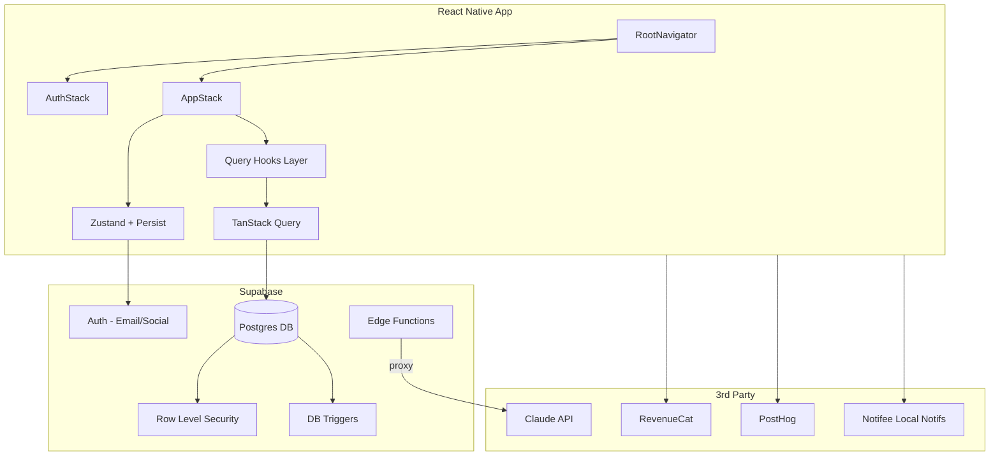
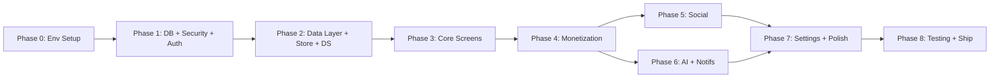

# HabitForge -- Full Build Execution Plan (v2 -- Gaps Addressed)

## Current State Assessment

The project is a **React Native 0.85.2** (TypeScript) app with:

- Navigation structure in place (React Navigation v7, native stack + bottom tabs)
- Zustand global store (auth flag, userId, isPro)
- Design tokens defined (Colors, Typography, Spacing, Radius, Shadow)
- Supabase client initialized; Claude API client initialized **client-side (security risk)**
- Env config with Zod validation via `react-native-config`
- **All 10 screens are empty placeholder shells** (just a title text)
- **No database tables deployed** (fresh Supabase project)
- **No RLS policies beyond 2 partial ones** in the schema SQL
- **No auth flow wired** (no session listener, no conditional navigation)
- **No real UI components** (no buttons, cards, inputs, modals)
- **No data fetching** (TanStack Query imported but unused)
- **No notifications, payments, or analytics** initialized

### Issues Found in Scaffolding

1. **Import path bugs** in `BottomTabNavigator.tsx` and `AuthStack.tsx` -- use `../features/...` from `core/navigation/` which resolves to `core/features/` (does not exist); should be `../../features/...`
2. **Onboarding screens** (`OnboardingScreen.tsx`, `LoginScreen.tsx`, `SignupScreen.tsx`) use `../../core/...` instead of `../../../core/...`
3. **No auth-gated navigation** -- `RootNavigator` always shows `AuthStack` first with no session check
4. **Incomplete RLS** -- only 2 policies for `habits` table; 6 other tables have RLS enabled but zero policies (blocks all access)
5. `**HabitDetailScreen` and `FriendProfileScreen**` co-located in unrelated files instead of own modules
6. **Missing docs** -- `ARCHITECTURE.md`, `CONTRIBUTING.md`, `SCHEMA.md`, `FEATURES.md`, `AI_NUDGES.md` referenced in README do not exist
7. **README version mismatch** -- says "RN 0.74+" and "Navigation v6" but project uses RN 0.85.2 and Nav v7
8. **CRITICAL: Anthropic SDK client-side** -- API key exposed in JS bundle; must proxy via Edge Function
9. **No `.env` file** -- only `.env.example` exists; app crashes on launch (`envSchema.parse` throws)
10. **No session persistence** -- Supabase client lacks AsyncStorage adapter; user logged out on every restart
11. **No DB triggers** -- no profile auto-creation on signup, no streak computation, no `updated_at` auto-update
12. **No indexes** beyond primary keys -- performance bottleneck on core queries
13. **Navigation params all `undefined**` -- detail screens need typed params (`habitId`, `userId`, `challengeId`)
14. **No data layer** -- no query hooks, no query key conventions, no optimistic updates
15. **No charting library** -- Analytics screen needs charts but none in `package.json`
16. **No PostHog initialization** -- dependency installed but never wired
17. **Widget extension** listed as pro feature but no implementation plan

---

## Architecture




---

## Execution Phases

### Phase 0: Environment Setup (Pre-requisite)

Before any development can start:

- **Create `.env**` from `.env.example` with new Supabase project URL (`https://btxidmhzxvxdhlipirgu.supabase.co`) + anon key from `get_publishable_keys`
- **Add missing dependency**: `@react-native-async-storage/async-storage` (required for Supabase session persistence)
- **Add charting library**: `victory-native` + `react-native-svg` (for Analytics screen)
- **Run `npm install --legacy-peer-deps**` and verify it succeeds
- **Fix all import path bugs** (details below) so Metro can bundle:
  - [src/core/navigation/BottomTabNavigator.tsx](src/core/navigation/BottomTabNavigator.tsx): change `../features/` to `../../features/` on all 4 imports
  - [src/core/navigation/AuthStack.tsx](src/core/navigation/AuthStack.tsx): change `../features/` to `../../features/` on all 3 imports
  - [src/features/onboarding/screens/OnboardingScreen.tsx](src/features/onboarding/screens/OnboardingScreen.tsx): change `../../core/` to `../../../core/`
  - Same fix for [LoginScreen.tsx](src/features/onboarding/screens/LoginScreen.tsx) and [SignupScreen.tsx](src/features/onboarding/screens/SignupScreen.tsx)
- **Run Metro** (`npx react-native start`) and confirm the app compiles and renders on device/emulator
- **Update navigation types** in [src/core/navigation/types.ts](src/core/navigation/types.ts):
  - `HabitDetail: { habitId: string }`
  - `FriendProfile: { userId: string }`
  - `ChallengeDetail: { challengeId: string }`
- **Extract co-located screens** to their own files:
  - `HabitDetailScreen` -> `src/features/habits/screens/HabitDetailScreen.tsx`
  - `FriendProfileScreen` -> `src/features/social/screens/FriendProfileScreen.tsx`
  - `ChallengeDetailScreen` -> `src/features/social/screens/ChallengeDetailScreen.tsx`
  - Update imports in [AppStack.tsx](src/core/navigation/AppStack.tsx)

---

### Phase 1: Database + Security + Auth

**1.1 -- Apply Supabase Schema via Migrations**

Deploy tables from [supabase-schema.sql](supabase-schema.sql) as ordered migrations:

- Migration 1: `profiles` table (references `auth.users`)
- Migration 2: `habits` table (references `profiles`)
- Migration 3: `habit_completions` table (references `habits` + `profiles`)
- Migration 4: `habit_streaks` table (references `habits`)
- Migration 5: `friendships` table (references `profiles` x2)
- Migration 6: `challenges` + `challenge_participants` tables
- Migration 7: `ai_nudges` table

**1.2 -- Database Triggers + Functions (GAP FIX)**

These are critical backend logic that the original schema was missing:

- **Profile auto-creation trigger**: Postgres function on `auth.users` `AFTER INSERT` that inserts a row into `profiles` with `id = NEW.id`, `username = NEW.email` (or a generated slug). Without this, all FK queries fail after signup.
- **Streak computation trigger**: Postgres function on `habit_completions` `AFTER INSERT OR DELETE` that:
  - Counts consecutive days backward from today for `current_streak`
  - Compares with `longest_streak` and updates if exceeded
  - Sets `last_completed_date`
  - Uses the habit's `frequency_type` to determine what counts as a "streak day" (daily = every day, weekly = at least N times per week, etc.)
- `**updated_at` auto-update trigger**: Use `moddatetime` extension or a custom trigger function on `profiles`, `habits`, `habit_completions` to auto-set `updated_at = now()` on UPDATE
- **Enable `moddatetime` extension** if using it

**1.3 -- Complete RLS Policies + Indexes (GAP FIX)**

RLS for all 8 tables (the schema only had 2 policies for `habits`):

- `profiles`:
  - SELECT own: `auth.uid() = id`
  - UPDATE own: `auth.uid() = id`
  - SELECT friends: via accepted `friendships` join
- `habit_completions`:
  - ALL own: `auth.uid() = user_id`
- `habit_streaks`:
  - SELECT/UPDATE own: `auth.uid() = (SELECT user_id FROM habits WHERE id = habit_id)`
- `friendships`:
  - SELECT: `auth.uid() IN (requester_id, addressee_id)`
  - INSERT: `auth.uid() = requester_id`
  - UPDATE status: `auth.uid() = addressee_id`
  - DELETE: `auth.uid() IN (requester_id, addressee_id)`
- `challenges`:
  - ALL for creator: `auth.uid() = creator_id`
  - SELECT for participants: via `challenge_participants` join
- `challenge_participants`:
  - INSERT: `auth.uid() = user_id`
  - SELECT: user is a participant in the same challenge
  - DELETE: `auth.uid() = user_id`
- `ai_nudges`:
  - ALL own: `auth.uid() = user_id`

**Performance indexes** (migration):

- `CREATE INDEX idx_habits_user_id ON habits(user_id)`
- `CREATE INDEX idx_completions_user_date ON habit_completions(user_id, completed_date)`
- `CREATE INDEX idx_completions_habit_date ON habit_completions(habit_id, completed_date)`
- `CREATE INDEX idx_friendships_requester ON friendships(requester_id)`
- `CREATE INDEX idx_friendships_addressee ON friendships(addressee_id)`
- `CREATE INDEX idx_nudges_user_created ON ai_nudges(user_id, created_at DESC)`
- `CREATE INDEX idx_challenges_creator ON challenges(creator_id)`

**1.4 -- Security Fix: Move Claude API to Edge Function (GAP FIX)**

This MUST happen before any app distribution:

- Deploy Supabase Edge Function `generate-nudge`:
  - Accepts `{ habitName, streakCount, habitId }` in POST body
  - Validates JWT from `Authorization` header
  - Calls Claude API with the system prompt from `constants.ts`
  - Inserts result into `ai_nudges` table
  - Returns nudge text
- **Remove** `@anthropic-ai/sdk` from `package.json` dependencies
- **Delete** `src/core/api/claude.ts`
- **Remove** `ANTHROPIC_API_KEY` from `.env` / `.env.example` / `env.ts` schema (key now lives only in Edge Function secrets)
- Create a client-side helper `src/core/api/nudge.ts` that calls the Edge Function via `supabase.functions.invoke('generate-nudge', ...)`

**1.5 -- Auth Flow**

- **Add AsyncStorage adapter** to Supabase client in [src/core/api/supabase.ts](src/core/api/supabase.ts):

```typescript
import AsyncStorage from '@react-native-async-storage/async-storage';
export const supabase = createClient(env.SUPABASE_URL, env.SUPABASE_ANON_KEY, {
  auth: {
    storage: AsyncStorage,
    autoRefreshToken: true,
    persistSession: true,
    detectSessionInUrl: false,
  },
});
```

- **Auth-gated navigation** in [RootNavigator.tsx](src/core/navigation/RootNavigator.tsx):
  - On mount, call `supabase.auth.getSession()` to check for persisted session
  - Subscribe to `supabase.auth.onAuthStateChange` and update `useGlobalStore`
  - Show a splash/loading state while session is being checked
  - Render `AuthStack` if not authenticated, `AppStack` if authenticated
- **Build real LoginScreen**: email + password inputs, "Sign In" button, "Forgot password?" link, "Don't have an account? Sign up" navigation
- **Build real SignupScreen**: email + password + confirm password, "Create Account" button, "Already have an account? Login" navigation
- **Build OnboardingScreen**: 3-4 swipeable slides explaining the app value prop, "Get Started" CTA navigating to Signup

---

### Phase 2: Data Layer + Store + Design System

**2.1 -- Data Access Layer (GAP FIX)**

Create a structured data layer before building screens:

- **Generate Supabase TypeScript types** using `supabase gen types typescript` and save to `src/core/api/database.types.ts`. Pass these to `createClient<Database>(...)` for fully typed queries.
- **Query hooks convention**: Each feature gets a `hooks/` folder:
  - `src/features/habits/hooks/useHabits.ts` -- fetch user's habits
  - `src/features/habits/hooks/useHabitCompletions.ts` -- fetch completions for a date range
  - `src/features/habits/hooks/useToggleCompletion.ts` -- mutation with optimistic update
  - `src/features/tracking/hooks/useTodayData.ts` -- combined query for today view
  - `src/features/analytics/hooks/useAnalytics.ts` -- aggregated stats
  - `src/features/social/hooks/useFriends.ts` -- friendships + requests
  - etc.
- **Query key factory** in `src/core/api/queryKeys.ts`:

```typescript
export const queryKeys = {
  habits: {
    all: ['habits'] as const,
    byUser: (userId: string) => ['habits', userId] as const,
  },
  completions: {
    byDate: (date: string) => ['completions', date] as const,
    byHabit: (habitId: string) => ['completions', habitId] as const,
  },
  // ...
};
```

- **Optimistic updates** for tap-to-complete: when user taps a habit, immediately update the UI via `queryClient.setQueryData` before the Supabase insert resolves. Roll back on error.

**2.2 -- Expand Zustand Stores (GAP FIX)**

The current global store is too thin. Expand:

- **Global store** (`global.store.ts`): add `userProfile` (display name, avatar, timezone), `isLoading` (initial session check), `hasCompletedOnboarding`
- **Add `zustand/middleware` persist** with AsyncStorage so auth state survives app kills:

```typescript
import { persist, createJSONStorage } from 'zustand/middleware';
import AsyncStorage from '@react-native-async-storage/async-storage';

export const useGlobalStore = create<GlobalStore>()(
  persist(
    (set) => ({ /* ... */ }),
    { name: 'global-store', storage: createJSONStorage(() => AsyncStorage) }
  )
);
```

- Consider feature-level stores only if state doesn't need to cross feature boundaries (most state will flow through TanStack Query, so Zustand stays lean for auth/user/pro status)

**2.3 -- Design System Components**

Build in `src/core/design-system/components/`:

- `Button` -- primary, secondary, outline, ghost variants; loading state
- `TextInput` -- with label, error message, left/right icon slots
- `Card` -- surface container using `Colors.surface` + `Shadow.sm`
- `ScreenContainer` -- `SafeAreaView` + `Colors.background` + optional `ScrollView`
- `Avatar` -- image with fallback initials circle
- `Badge` -- small pill for streak count, notification count
- `BottomSheet` -- modal sheet (can use `@gorhom/bottom-sheet` or build simple one)
- `EmptyState` -- centered icon + message + CTA button
- `HabitTile` -- the core card: icon, name, color accent, streak badge, completion circle
- `StreakIndicator` -- flame icon + count with color based on streak length
- `ProgressRing` -- SVG-based circular progress (using `react-native-svg`)
- `TabBar` -- custom bottom tab bar with `react-native-vector-icons` icons

---

### Phase 3: Core Feature Screens

**3.1 -- Today Screen** ([TodayScreen.tsx](src/features/tracking/screens/TodayScreen.tsx))

- Header: greeting ("Good morning, {name}") + today's date + overall streak
- `FlashList` of `HabitTile` components showing today's habits
- Each tile shows: habit icon, name, current streak, completion state for today
- **Tap-to-complete**: toggles completion with optimistic update + streak recalc
- `ProgressRing` at top showing X/Y habits completed today
- Pull-to-refresh via TanStack Query `refetch`
- Empty state for new users with CTA to add first habit
- Data sources: `useHabits()` + `useTodayCompletions()` + habit streaks joined

**3.2 -- Add Habit Screen** ([AddHabitScreen.tsx](src/features/habits/screens/AddHabitScreen.tsx))

- Form fields: habit name (`TextInput`), icon picker (emoji grid or curated set), color picker (swatches from `Colors.tiles`)
- Frequency selector: "Daily" | "X times per week" | "X times per month" with numeric stepper
- Public/private toggle for social visibility
- **Free-tier gate**: check habit count before insert; if >= `FREE_LIMITS.maxHabits` (5) and not pro, navigate to Paywall
- On submit: insert into `habits` + upsert `habit_streaks` row (initial zeros)

**3.3 -- Habit Detail Screen** (`src/features/habits/screens/HabitDetailScreen.tsx`)

- Receives `habitId` via route params
- Header: colored accent bar, icon, name, current/longest streak
- **Calendar heatmap**: grid of last 30/90 days, colored by completion (green) vs missed (gray)
- Stats card: total completions, completion rate %, best day of week
- Edit button -> inline edit or modal for name/icon/color/frequency
- Archive and delete actions with confirmation
- **Free-tier gate**: if not pro, only show last 7 days of history with a blurred overlay + upgrade CTA

**3.4 -- Analytics Screen** ([AnalyticsScreen.tsx](src/features/analytics/screens/AnalyticsScreen.tsx))

- **Add `victory-native` + `react-native-svg**` to dependencies (charting library -- GAP FIX)
- Weekly completion rate bar chart (`VictoryBar`)
- Habit ranking: best and worst performing habits by completion %
- Trend line showing daily completion rate over time (`VictoryLine`)
- Personal bests: longest streak, most consistent habit, best week
- **Free-tier gate**: 7-day window; blur older data with upgrade CTA

---

### Phase 4: Monetization (before building gated features)

**4.1 -- RevenueCat Integration**

- Initialize in `app.tsx`:

```typescript
import Purchases from 'react-native-purchases';
Purchases.configure({
  apiKey: Platform.OS === 'ios' ? env.REVENUECAT_IOS_KEY : env.REVENUECAT_ANDROID_KEY,
});
```

- On auth state change, call `Purchases.logIn(userId)` to associate user
- Listen to `Purchases.addCustomerInfoUpdateListener` and sync `isPro` to store + Supabase `profiles.is_pro`

**4.2 -- Paywall Screen** ([PaywallScreen.tsx](src/features/paywall/screens/PaywallScreen.tsx))

- Fetch offerings via `Purchases.getOfferings()`
- Display pricing: monthly (Rs 199 / $2.99) + lifetime (Rs 1999 / $24.99)
- Feature comparison list (free vs pro)
- Purchase button + restore purchases button
- Handle errors, loading states, success confirmation

**4.3 -- Feature Gating Hook**

- Create `src/core/hooks/useProGate.ts`:

```typescript
export function useProGate() {
  const isPro = useGlobalStore(s => s.isPro);
  const navigation = useNavigation();
  const requirePro = (callback: () => void) => {
    if (isPro) { callback(); }
    else { navigation.navigate('Paywall'); }
  };
  return { isPro, requirePro };
}
```

- Apply gates per `FREE_LIMITS` in [constants.ts](src/core/config/constants.ts)

**4.4 -- Streak Recovery Logic (GAP FIX)**

- Streak recovery = allow pro users to "fill in" a missed day to preserve a streak
- Rules: can be used once per 30 days (`streak_recovery_used_at` in `profiles`)
- UI: when a streak is broken (current_streak = 0 but was > 0 yesterday), show a "Recover Streak" button on TodayScreen
- Logic: inserts a backdated `habit_completion` for the missed date, re-triggers streak computation, updates `streak_recovery_used_at`
- Pro-only: free users see the button but it navigates to Paywall

---

### Phase 5: Social Features

**5.1 -- Social Screen** ([SocialScreen.tsx](src/features/social/screens/SocialScreen.tsx))

- **Pro gate**: if not pro, show locked state with upgrade CTA (per `FREE_LIMITS.socialFeatures`)
- Friend list: `FlashList` of accepted friends with avatars, names, streak summaries
- Search: text input to search by username, shows results with "Add Friend" button
- Pending requests section: incoming requests with accept/decline buttons
- Sent requests: with cancel option

**5.2 -- Friend Profile Screen** (`src/features/social/screens/FriendProfileScreen.tsx`)

- Receives `userId` via route params
- Display friend's public habits and their streaks
- Mutual challenges list
- "Remove Friend" action

**5.3 -- Challenges**

- **Create Challenge flow**: modal/screen with title, habit template (name/icon/color/frequency), start/end dates, invite friends from friend list
- **Challenge Detail Screen** (`src/features/social/screens/ChallengeDetailScreen.tsx`): receives `challengeId`, shows participants list with completion leaderboard, daily progress
- **Join challenge**: for now, via in-app invite from friend list (deep links deferred to Phase 7 polish -- native config required)

---

### Phase 6: AI Nudges + Notifications + Analytics

**6.1 -- AI Nudge Trigger Logic**

The Edge Function was deployed in Phase 1.4. Now wire the trigger logic:

- **Streak-at-risk**: when a user hasn't completed a daily habit by evening (e.g., 8 PM in their timezone), call the Edge Function and schedule a notification
- **Milestone**: when `current_streak` hits 7, 14, 30, 50, 100 days, generate a celebratory nudge
- **Pattern detection**: if completion rate drops below 50% for a week, generate an encouragement nudge
- Store all nudges in `ai_nudges` table with type categorization
- Pro-only: free users don't receive AI nudges

**6.2 -- Notifee Local Notifications**

- Request notification permissions on first app open (post-onboarding)
- **Daily reminders**: user-configurable time (default 9 AM) -- "Time to check in on your habits!"
- **Streak-at-risk**: triggered by nudge logic above -- shows AI-generated text
- **Milestone celebrations**: triggered on streak milestones
- Notification tap: deep link to TodayScreen or specific HabitDetail
- Settings controls: enable/disable per notification type, set reminder time

**6.3 -- PostHog Analytics Init (GAP FIX)**

- Wrap app in `PostHogProvider` in `app.tsx` with API key + host from env
- Track key events: `habit_created`, `habit_completed`, `streak_milestone`, `paywall_shown`, `purchase_completed`, `friend_added`, `challenge_joined`
- Auto-track screen views via navigation state listener
- Identify user on login: `posthog.identify(userId, { isPro, habitCount })`

---

### Phase 7: Settings + Polish

**7.1 -- Settings Screen** ([SettingsScreen.tsx](src/features/settings/screens/SettingsScreen.tsx))

- **Profile section**: avatar (upload to Supabase Storage or use URL), display name edit, username display
- **Notifications**: toggle reminders, set reminder time, toggle streak warnings
- **Subscription**: show current plan (Free/Pro), manage/upgrade CTA -> Paywall
- **Data & Privacy**: export data (pro -- generate CSV of completions), timezone selector
- **Account**: logout (`supabase.auth.signOut()` + clear stores), delete account (with confirmation + `supabase.auth.admin.deleteUser` via Edge Function)
- **About**: app version, terms, privacy policy links

**7.2 -- Custom Bottom Tab Bar**

- Replace default tab bar with custom component using `react-native-vector-icons`
- Icons: Home (calendar-check), Stats (bar-chart), Social (users), Profile (user-cog)
- Active state: primary color + label; inactive: muted color
- Optional: center FAB for "quick add habit"

**7.3 -- UX Polish**

- Haptic feedback on habit completion toggle (`react-native-haptic-feedback` -- add dependency)
- Screen transition animations (native stack defaults are good, customize modals)
- Loading skeletons for all data-fetching screens (shimmer placeholders)
- Error boundaries with retry buttons at screen level
- Splash screen: configure via `react-native-bootsplash` or similar
- App icon: provide assets for both platforms

---

### Phase 8: Testing + Production Readiness

**8.1 -- Testing**

- Unit tests: Zustand store logic, streak calculation edge cases, query key factories
- Component tests: `HabitTile`, `ProgressRing`, `Button` variants (using `@testing-library/react-native`)
- Integration tests: auth flow (login -> navigate to app -> logout), habit CRUD cycle
- E2E (stretch goal): Detox or Maestro for critical paths

**8.2 -- Production Hardening**

- Release signing config for Android (generate upload keystore, configure in `build.gradle`)
- iOS release config (certificates, provisioning profiles)
- ProGuard / R8 rules review for release minification
- Performance profiling: check FlashList render performance, identify unnecessary re-renders with React DevTools
- Sentry or equivalent error reporting integration
- Review all env vars are production-ready (no test keys)

**8.3 -- Deferred Items (Post-Launch)**

These are real features in the codebase intent but too complex for initial launch:

- **Widget extension** (`react-native-widget-extension` is in deps): requires native iOS WidgetKit + Android AppWidget development. Recommend deferring to v1.1.
- **Deep links for challenge invites**: requires Android `intent-filter` with custom scheme or App Links + iOS Universal Links + Associated Domains. Recommend deferring to v1.1.
- **Social login** (Google/Apple sign-in): can be added post-launch; email/password is sufficient for MVP.
- **Light mode theme**: tokens are dark-first; light mode requires a full parallel color set. Defer.

---

## Recommended Build Order (Critical Path)




**Rationale:**

- Phase 0 first: the app literally cannot run without `.env` and import fixes
- DB + security before anything: tables and auth are prerequisites for all features
- Data layer before screens: screens need hooks and typed queries to build against
- Monetization before social/AI: those features are pro-gated, so the gate must exist first
- Social and AI/notifications can be parallelized (independent feature branches)
- Settings and polish after all features are built (references all other screens)
- Testing last: test against the real, complete codebase

